# SmartQueue — Skip the Wait

A full-stack real-time queue management system for clinics, salons, government offices and small branches. Customers book slots online, get a token with a QR code, and track their queue position live.

---

## Tech Stack

| Layer | Tech |
|---|---|
| **Frontend** | React + Vite + Tailwind CSS |
| **Backend** | Java 17+ / Spring Boot 3.x (Spring Security, Spring Data JPA, Hibernate) |
| **Real-time** | SSE (Server-Sent Events) |
| **Database** | PostgreSQL / Supabase |
| **Auth** | JWT + BCrypt |
| **SMS/Email** | Twilio & Spring Mail (Mocked in console by default) |
| **QR Code** | ZXing (Backend generation) + `html5-qrcode` (Frontend scanner) |

---

## Quick Start

### 1. Clone the repository

```bash
git clone <your-repo>
cd smart-queue
```

### 2. Set up the Database

1. Start your local PostgreSQL server or create a project at [supabase.com](https://supabase.com).
2. Create a database named `smart-queue-management`.
3. Run the database structure script `schema.sql` located at the root directory to set up the initial tables.

### 3. Configure the Backend

Edit the properties in `server/src/main/resources/application.properties`:

```properties
spring.datasource.url=jdbc:postgresql://localhost:5432/smart-queue-management
spring.datasource.username=postgres
spring.datasource.password=12345
```

### 4. Run the Application

You can run both front-end and back-end concurrently from the root directory:

```bash
npm install
npm run dev
```

Or run them in separate terminals:

**Backend (Spring Boot):**
```bash
cd server
.\mvnw.cmd spring-boot:run
```

**Frontend (React/Vite):**
```bash
cd client
npm install
npm run dev
```

---

## Project Structure

```
smart-queue/
├── client/                     # React + Vite Client
│   └── src/
│       ├── pages/
│       │   ├── Home.jsx         # Browse business directories
│       │   ├── Login.jsx
│       │   ├── Register.jsx
│       │   ├── BookSlot.jsx     # Select date + slot card
│       │   ├── MyToken.jsx      # Queue position tracker, download options & QR
│       │   ├── AdminDashboard.jsx
│       │   └── QueueBoard.jsx   # Live TV display view
│       ├── components/
│       │   └── Layout.jsx
│       ├── hooks/
│       │   └── useSSE.js        # EventSource connection hook
│       └── lib/
│           └── api.js           # Axios instance with JWT interceptor
│
└── server/                     # Java Spring Boot Server
    ├── src/main/java/com/smartqueue/server/
    │   ├── config/              # Security configurations & CORS
    │   ├── controller/          # REST Endpoints (Auth, Booking, Slot, etc.)
    │   ├── entity/              # JPA Model Definitions (User, Business, Slot, Booking)
    │   ├── repository/          # JpaRepository Interfaces
    │   ├── security/            # JWT Authorization Filters
    │   └── service/             # Logic services (SSE, QR, Twilio, Email)
    └── src/main/resources/
        └── application.properties # Server database & configuration properties
```

---

## Key Features

### 📅 Batch Slot Creation
Admins can check **"Create for entire month"** on the slot generation form. The server automatically generates active slots day-by-day from the selected date to the last day of the calendar month, bypassing duplicates and rejecting active time conflicts with `400 Bad Request`.

### 🏢 Multi-Branch & Staff Differentiation
Admins owning multiple business locations or branches (e.g., Downtown branch) can toggle cleanly between them. The Staff Management panel correctly filters, displays, and updates staff rosters associated exclusively with the active branch instead of returning overlapping listings.

### 🎫 Interactive Ticket & QR Download
Customers can view their booking token and download receipt information on demand:
- **Download Ticket**: Generates a high-quality shareable `.png` card rendering the business brand, token number, slot timing details, and check-in QR code onto a unified canvas ticket.
- **QR Code Only**: Downloads the raw high-resolution base64 PNG check-in QR code immediately.

---

## Visual Walkthrough & Screenshots

### 1. Landing & Authentication
*   **Landing Page**: The entry page featuring clean glassmorphism UI elements, dark mode toggles, and direct links to check directory.
    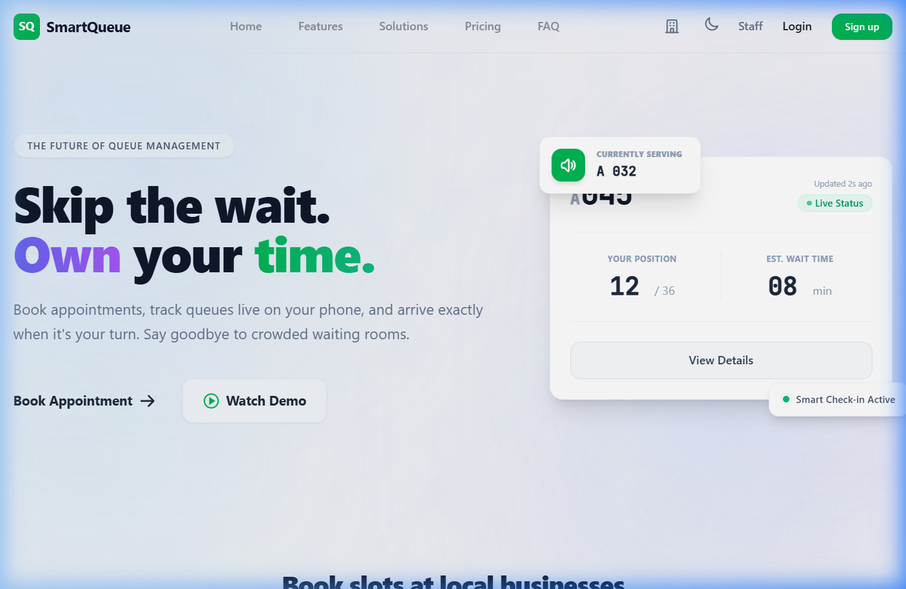
*   **Registration Portal**: Smooth animated sign-up portal for new customers.
    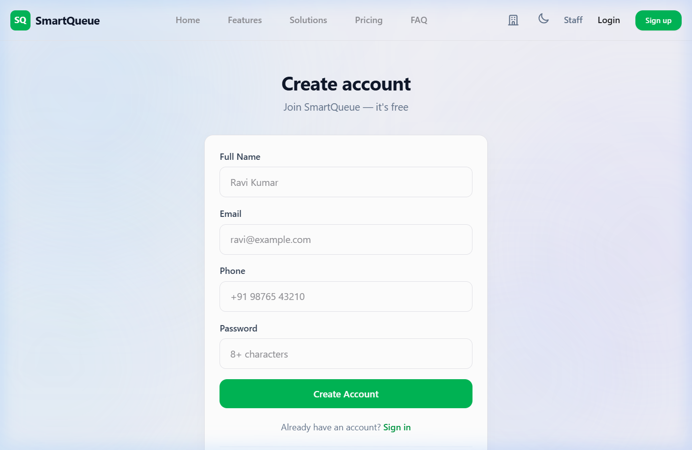

### 2. Customer Queueing Experience
*   **Business Directory**: Interactive board displaying all registered branches and categories (salons, clinics, banks).
    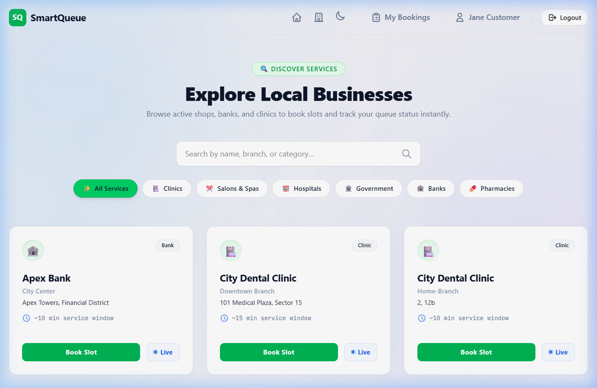
*   **Slot Booking**: Customers choose slots for specific dates. The UI shows an occupancy progress indicator bar.
    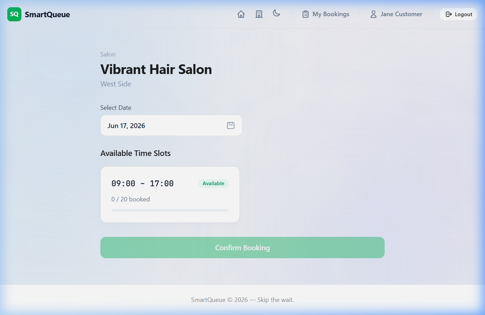
*   **Live Token Details**: After booking, customers receive their digital token receipt featuring an auto-generated check-in QR code, real-time live position tracking (using SSE), and canvas ticket downloading capabilities.
    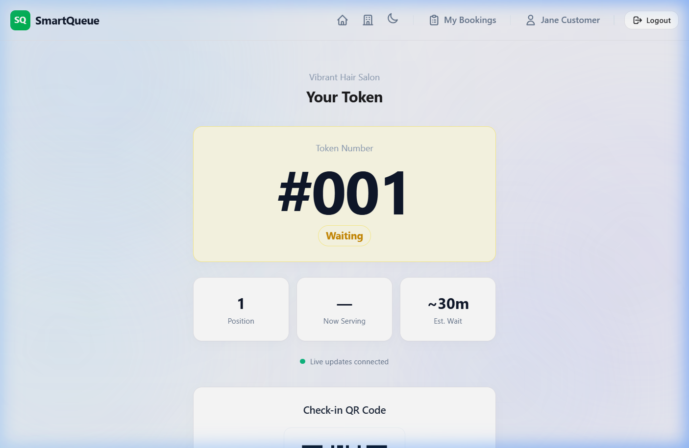
*   **My Bookings**: Customer personal list showing current active and historical slots.
    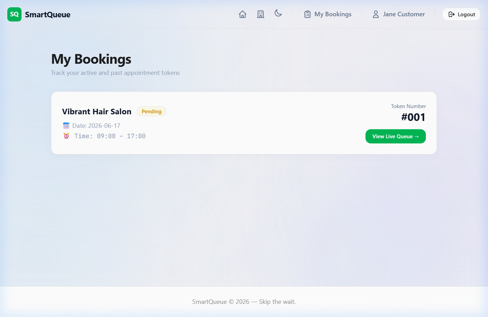

### 3. Admin Management Panel
*   **Staff and Admin Login**: Portal interface permitting staff and admin authentication.
    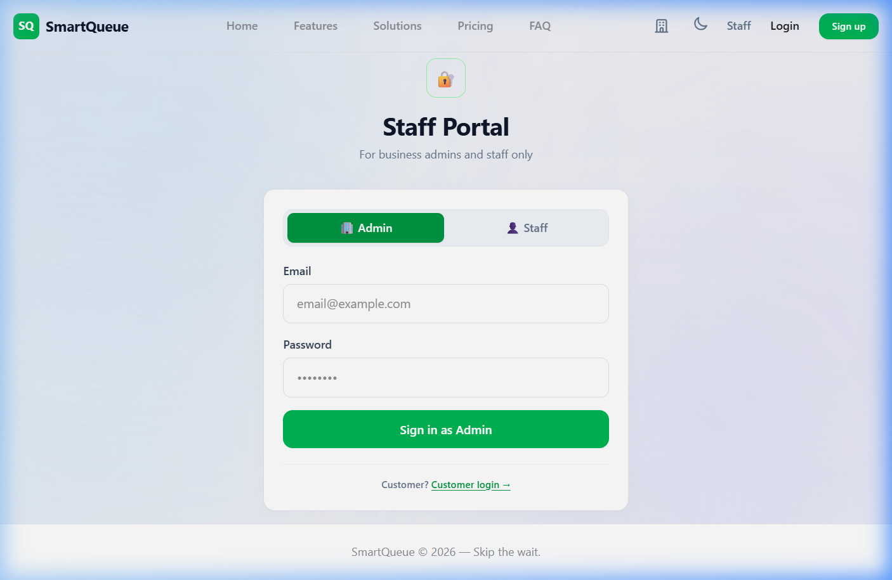
*   **Admin Dashboard**: Overview of operations where business admins configure branches, schedules, and view queue statuses.
    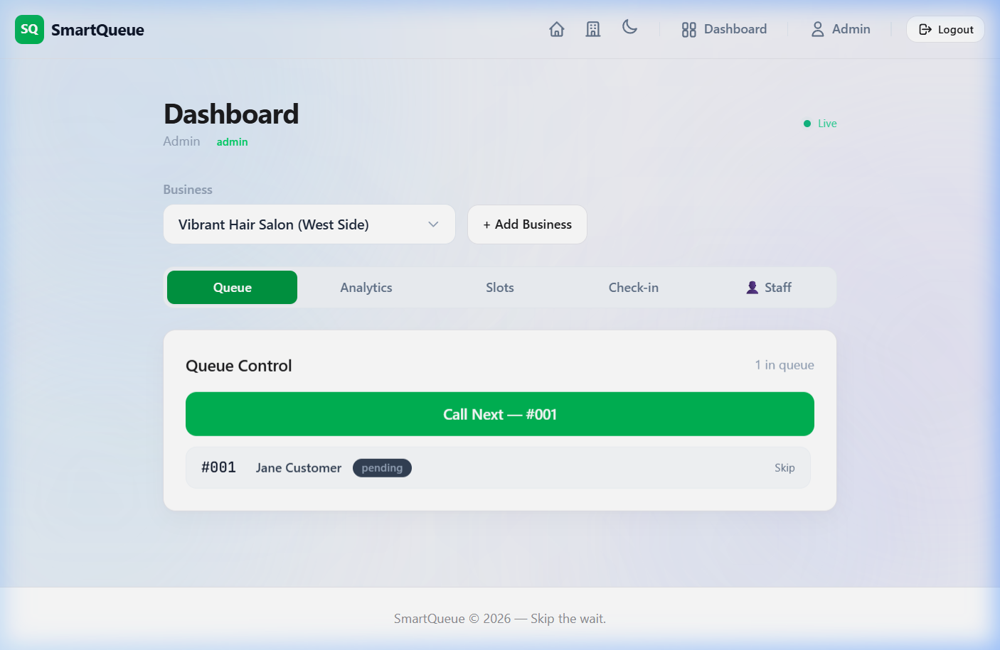
*   **Staff Roster Management**: Interface for business owners to enroll and assign staff members to branches.
    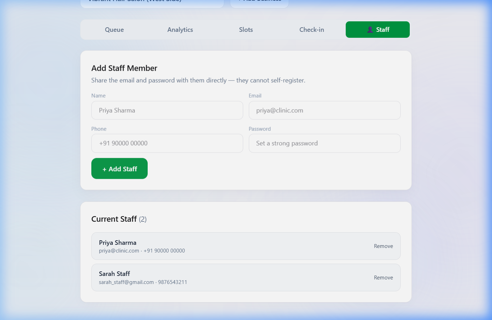

### 4. Staff Queue Operations
*   **Staff Dashboard**: Dashboard where branch staff call next tickets and manage the active queue live.
    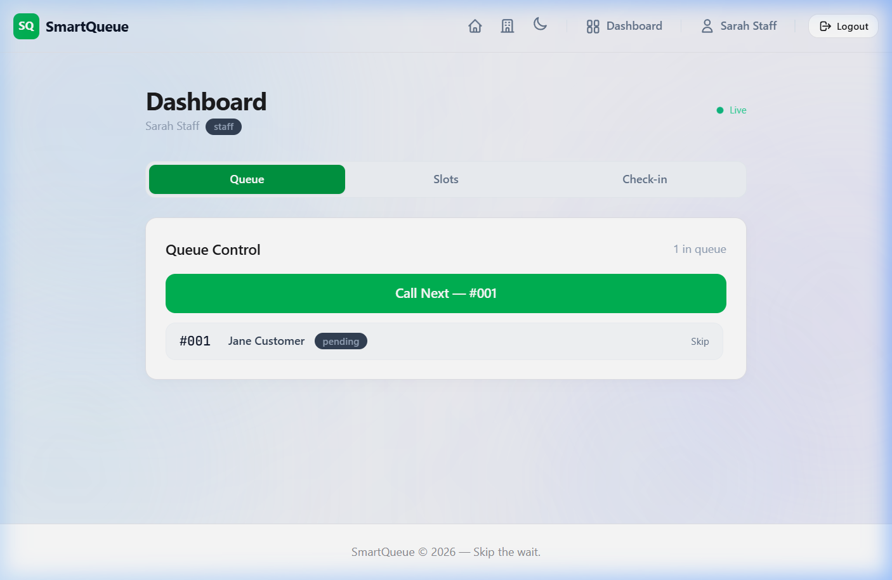
*   **Active Ticket Service**: Showing detail of the customer currently called, with quick check-in, serve, skipped, or done triggers.
    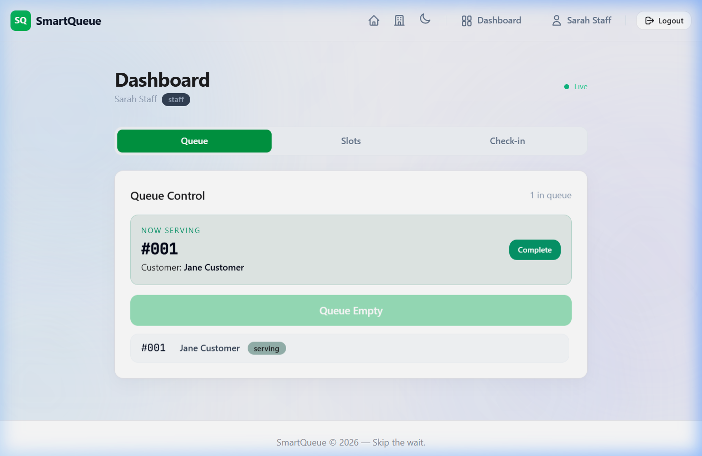

### 5. Live Queue TV Board
*   **Public Display TV Board**: Fullscreen Queue Board intended for public TV displays in waiting rooms, updating in real-time via SSE.
    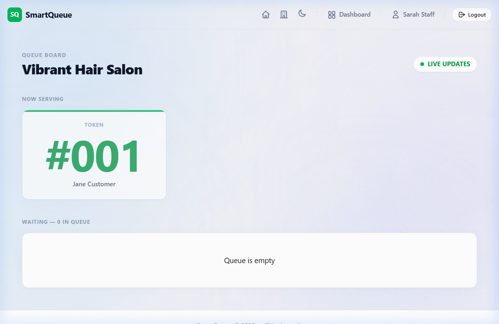

---

## Real-Time SSE Flow

```
Admin updates state (e.g. Call Next, Check-in)
                 ↓
      POST /api/bookings/checkin
                 ↓
   Database updates status in transactions
                 ↓
  Invalidates cache and updates QueueService
                 ↓
   SseService broadcasts JSON stream to SSE
                 ↓
EventSource in client updates local state in React
```
